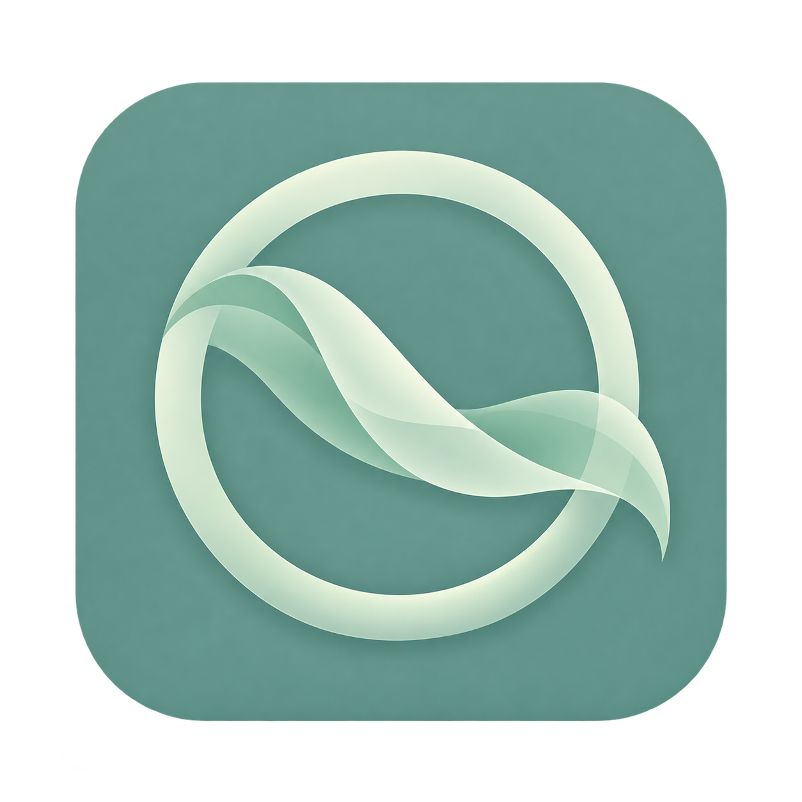
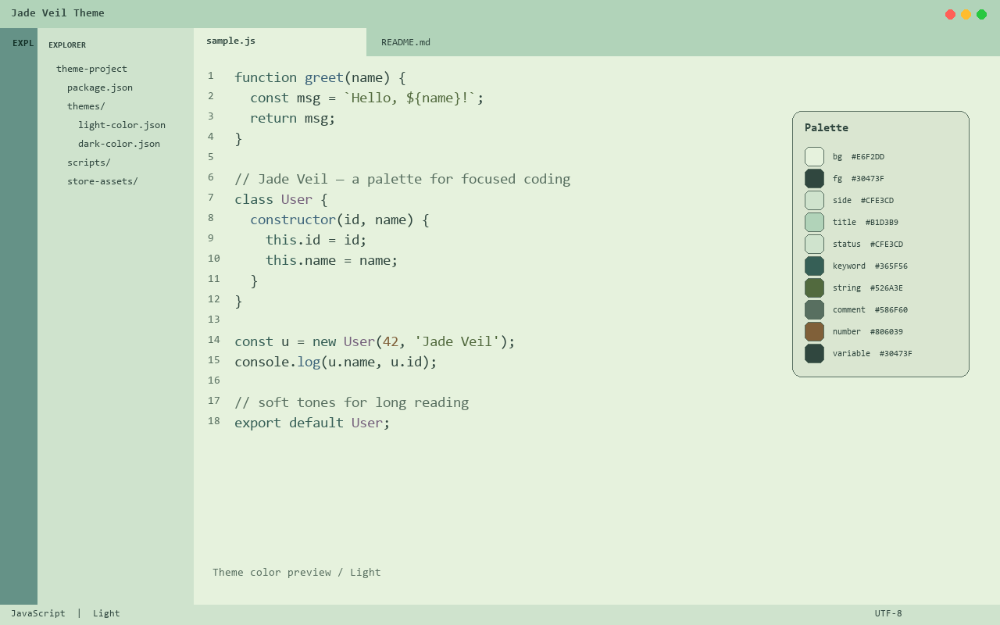
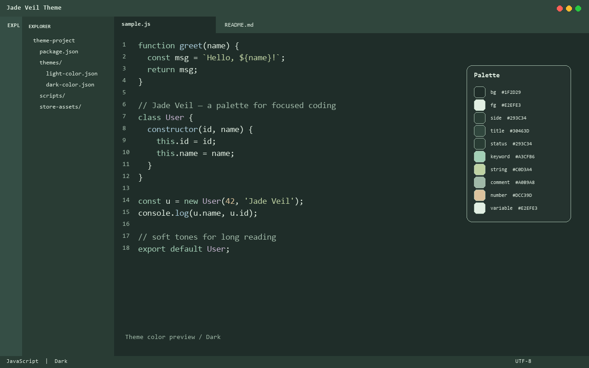

<p align="center">
  
</p>

<h1 align="center">Jade Veil Theme</h1>

<p align="center">
  <a href="https://code.visualstudio.com/docs/getstarted/themes"></a>
  
  
</p>

A calm, low-contrast editor theme built around a **muted jade** base, with soft mauve for types, quiet blue for functions, and warm tan for numbers. Two coordinated variants share the same palette so your workspace stays consistent across light and dark.

## Preview

| Light | Dark |
| --- | --- |
|  |  |

> Previews are generated theme-color mockups, not native editor captures.

## Palette

The same accent set drives both variants — jade green for the UI and links, mauve for types and classes, and soft tan for numbers.

| Role | Light | Dark |
| --- | --- | --- |
| Editor background | `#E6F2DD` pale jade | `#1F2D29` deep green |
| Foreground | `#30473F` fern | `#E2EFE3` haze |
| Side bar / panel | `#CFE3CD` | `#293C34` |
| Title / status bar | `#B1D3B9` / `#CFE3CD` | `#30463D` / `#293C34` |
| Accent (links / focus) | `#3D695D` jade | `#A3CFB6` mist |
| Button | `#3D695D` | `#88BDA4` |
| Keywords | `#365F56` | `#A3CFB6` |
| Strings | `#526A3E` moss | `#C0D3A4` sage |
| Numbers | `#806039` tan | `#DCC39D` sand |
| Types / classes | `#75617C` mauve | `#C5B4CF` lavender |
| Functions | `#3E657B` slate | `#A8CAD8` ice |
| Comments | `#586F60` | `#A0B9A8` |
| Errors | `#AB4858` rose | `#E69DA8` blush |

## Features

- **Two coordinated variants** — `Jade Veil Theme Light` and `Jade Veil Theme Dark` in one extension.
- **Soft, low-contrast palette** tuned for long sessions without eye strain.
- **Full UI theming** — activity bar, status bar, side bar, terminal, and widgets follow the theme.
- **Syntax highlighting** — keywords, strings, types, functions, and markup styled with the shared palette.
- **Semantic highlighting** enabled for richer, language-aware colors.
- **Terminal ANSI colors** matched to the theme so the integrated terminal blends in.

## Installation

1. Download `jade-veil-theme-1.0.0.vsix`.
2. In VS Code, open the Command Palette and run **Extensions: Install from VSIX...**, then select the file.
3. Open the Command Palette and run **Preferences: Color Theme**, then choose **Jade Veil Theme Light** or **Jade Veil Theme Dark**.

## Development

Open this folder in VS Code and press **F5** to launch an Extension Development Host with the theme loaded.

Regenerate the preview images with:

```bash
python scripts/generate-store-screenshots.py
```

## Publisher

Published by **lilinhuang** on the Visual Studio Code Marketplace.
